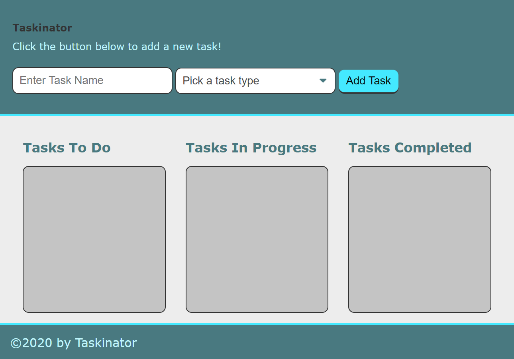

# Taskinator

## Description
Website that functionas a Kanban Board, allowing users to list tasks as To Do, In Progress or Completed.

Table of Contents |
-------------------|
[Usage](#Usage)
[Technologies](#Technologies)
[Screenshots](#Screenshots)
[Contributing](#Contributing)
[Author](#Author)
[Questions](#Questions)

 

## Usage

Taskinator was created using HTML, CSS and JavaScript. Leverages Web APIs such as the Web Storage API. The DOM is also used to target elements in order to execute function on certain events.

You can find the deployed link and the repository link below:

Deployed Link: [Deployed Link](https://cerafinn.github.io/taskinator)

Repo Link: [Repo Link](https://github.com/cerafinn/taskinator)

 

## Technologies

* HTML
* CSS
* JavaScript
* Web APIs

 

## Screenshots

## Contributing

If interested in contributing to the project, feel free to reach out. Contact information can be found in the Questions section.

 

## Author

Andaleeb Farooq: [:octocat:](https://github.com/cerafinn)

 

## Questions

If you have any questions or issues, feel free to reach out at: andaleeb.farooq@gmail.com.
You can also find more of my work on Github at [github link](https://github.com/cerafinn).